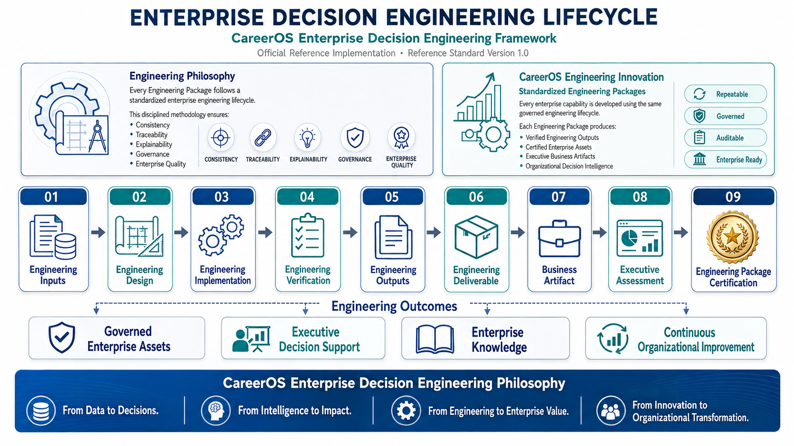

# CareerOS Enterprise Decision Engineering Framework (CEDEF)

### Official Reference Implementation

### 📄 Reference Standard Version 1.0

### Enterprise AI • Decision Intelligence • Executive Decision Support

---

## Chuck A. Munyah-Asaah

### Enterprise Data & AI Solutions Professional

**Architect & Creator of the CareerOS Enterprise Decision Engineering Framework**

*Designing governed Enterprise AI systems that transform enterprise data into explainable executive decision intelligence.*

---

# 🧭 Quick Navigation

| Section | Description |
|----------|-------------|
| 🚀 [Executive Summary](#executive-summary) | Overview of the CareerOS Enterprise Decision Engineering Framework (CEDEF) |
| 🏗 [Enterprise Framework Overview](#enterprise-framework-overview) | Figure 1 – Framework Architecture |
| 🏛 [Meet the Architect](#meet-the-architect) | Professional background and framework creator |
| 💡 [CareerOS Innovation](#careeros-innovation) | Figure 2 – Progressive Enterprise Asset Engineering Model |
| ⚙️ [Enterprise Engineering Methodology](#enterprise-engineering-methodology) | Figure 3 – Enterprise Decision Engineering Lifecycle |
| 🏪 [Reference Implementations](#reference-implementations) | Current and future CEDEF implementations |
| 🧠 [Professional Capabilities](#professional-capabilities) | Enterprise capabilities and technology ecosystem |
| 🔬 [Research, Innovation & Future Direction](#research-innovation--future-direction) | Research agenda and CEDEF roadmap |
| 🤝 [Connect](#connect) | Professional profiles and contact information |
| 📂 **[Official Retail Reference Implementation](https://github.com/camunyah/ai-demand-forecasting-inventory-optimization)** | AI-Driven Demand Forecasting & Inventory Optimization |

---

# Enterprise Framework Overview

---

# Executive Summary

The **CareerOS Enterprise Decision Engineering Framework (CEDEF)** is a governed enterprise engineering methodology for transforming enterprise data into explainable, auditable, and actionable executive decision intelligence.

Unlike traditional analytics methodologies that conclude with dashboards, reports, or predictive models, CEDEF integrates six enterprise intelligence layers into a unified engineering lifecycle that progresses systematically from **Enterprise Data Engineering** through **Executive Decision Engineering**.

At the core of the framework is **Progressive Enterprise Asset Engineering**, a disciplined methodology in which every engineering layer produces a **Certified Enterprise Asset** that becomes the engineering foundation for the next enterprise intelligence layer. This creates a governed, traceable, explainable, and progressively maturing enterprise intelligence lifecycle.

The **Official Retail Reference Implementation** demonstrates CEDEF through an end-to-end Enterprise AI solution integrating:

- 📈 Demand Forecasting
- 📦 Inventory Optimization
- 🤖 Machine Learning
- 📊 Business Intelligence
- 🧠 Decision Intelligence
- 👔 Executive Decision Support

Together, these capabilities establish a repeatable, governed, and enterprise-ready methodology for designing intelligent decision systems that support operational excellence, executive governance, and strategic organizational transformation.

---

> **Explore the Official Retail Reference Implementation**

➡️ **[AI-Driven Demand Forecasting & Inventory Optimization](https://github.com/camunyah/ai-demand-forecasting-inventory-optimization)**

---

# Meet the Architect

I am **Chuck A. Munyah-Asaah**, an **Enterprise Data & AI Solutions Professional** with a multidisciplinary background spanning Enterprise Information Systems, Healthcare Information Systems, National Health Information Systems, Business Intelligence, Data Analytics, Artificial Intelligence, and Executive Decision Support.

Over the course of my career, I have worked at the intersection of technology, healthcare, business operations, and organizational transformation, helping organizations leverage information systems and analytics to improve operational performance and decision-making.

My academic foundation includes a **Master of Science in Business and Data Analytics** from **California State University, San Bernardino**, where I strengthened my expertise in statistics, machine learning, predictive analytics, artificial intelligence, and enterprise business intelligence.

CDEF represents the convergence of my professional experience and academic training. It was developed to address a fundamental challenge observed across many organizations:

> **Organizations often possess abundant data, yet struggle to systematically transform that data into governed executive decision intelligence.**

Rather than viewing analytics, business intelligence, machine learning, and executive reporting as isolated disciplines, I believe they should operate as an integrated enterprise engineering lifecycle.

That philosophy led to the development of the CEDEF—a governed methodology that progressively transforms enterprise data into certified enterprise assets and ultimately into explainable, auditable, and actionable executive decision intelligence.

My long-term vision is to advance enterprise decision engineering through research, consulting, education, and enterprise software development, enabling organizations to make better decisions through disciplined engineering rather than isolated analytical techniques.

---

# CareerOS Innovation

---

## CareerOS Innovation

CEDEF introduces a disciplined approach to enterprise engineering by treating organizational intelligence as a sequence of progressively engineered and certified enterprise assets rather than isolated analytical outputs.

Traditional analytics initiatives often conclude with dashboards, reports, or predictive models.

CEDEF extends beyond these outcomes by introducing an enterprise engineering methodology that progressively transforms organizational knowledge into governed executive decision intelligence.

### Principal Contributions

The framework introduces several enterprise engineering concepts that collectively establish a repeatable and governed decision engineering methodology.

### Progressive Enterprise Asset Engineering

Rather than producing isolated analytical artifacts, every engineering layer produces a **Certified Enterprise Asset** that becomes the engineering foundation for the next enterprise intelligence layer.

This creates a governed, traceable, explainable, and progressively maturing enterprise intelligence lifecycle.

### Standardized Engineering Packages

Every capability within CEDEF is developed using a standardized engineering methodology consisting of:

- Engineering Inputs
- Engineering Design
- Engineering Implementation
- Engineering Verification
- Engineering Outputs
- Engineering Deliverable
- Business Artifact
- Executive Assessment
- Engineering Package Certification

This standardized lifecycle ensures consistency, repeatability, governance, and enterprise quality throughout the framework.

### Certified Enterprise Assets

Each engineering layer concludes with formal certification of the enterprise asset it produces.

These certified assets progressively mature organizational knowledge while maintaining governance, traceability, and executive confidence.

### Enterprise Decision Engineering

CEDEF integrates Enterprise Data Engineering, Business Intelligence Engineering, Enterprise AI Capability Engineering, Predictive Intelligence Engineering, Decision Intelligence Engineering, and Executive Decision Engineering into a single end-to-end enterprise methodology.

The result is a disciplined engineering framework capable of transforming enterprise data into explainable, auditable, and actionable executive decision intelligence.

---

---

# Enterprise Engineering Methodology

---

## Enterprise Engineering Methodology

CEDEF is built upon a standardized enterprise engineering methodology that governs the development of every capability within the framework.

Rather than developing analytics solutions through isolated experimentation, every Engineering Package follows the same disciplined engineering lifecycle.

This standardized methodology ensures that every enterprise capability is engineered consistently, verified systematically, documented comprehensively, and certified before becoming part of the enterprise intelligence ecosystem.

### Standard Engineering Lifecycle

Every Engineering Package progresses through the following engineering stages:

1. Engineering Inputs
2. Engineering Design
3. Engineering Implementation
4. Engineering Verification
5. Engineering Outputs
6. Engineering Deliverable
7. Business Artifact
8. Executive Assessment
9. Engineering Package Certification

This disciplined lifecycle enables Enterprise AI capabilities to be developed with the same rigor traditionally associated with mature engineering disciplines.

### Engineering Outcomes

By applying a standardized engineering methodology throughout the framework, CEDEF establishes:

- Governed Enterprise Assets
- Executive Decision Support
- Enterprise Knowledge
- Continuous Organizational Improvement

The result is an enterprise engineering methodology that is repeatable, explainable, auditable, and enterprise ready.

---

# Reference Implementations

The CareerOS Enterprise Decision Engineering Framework is designed as an enterprise methodology capable of supporting decision intelligence across multiple industries.

The following reference implementations demonstrate how CEDEF can be applied to solve complex organizational problems through Enterprise AI, Business Intelligence, Predictive Intelligence, Decision Intelligence, and Executive Decision Engineering.

---

## 🏪 Retail Decision Intelligence

### AI-Driven Demand Forecasting & Inventory Optimization

**Official Retail Reference Implementation**

This implementation demonstrates the complete CareerOS Enterprise Decision Engineering Framework through an end-to-end Enterprise AI solution that transforms retail transaction data into executive inventory planning intelligence.

### Enterprise Capabilities

### Business Outcomes

- 📈 Demand Forecasting
- 📦 Inventory Optimization
- 🤖 Machine Learning
- 📊 Business Intelligence
- 🧠 Decision Intelligence
- 👔 Executive Decision Support

> ### Repository

➡️ **Official Retail Reference Implementation**

### AI-Driven Demand Forecasting & Inventory Optimization

*Demonstrating the CareerOS Enterprise Decision Engineering Framework through Enterprise AI, Demand Forecasting, Inventory Optimization, and Executive Decision Support.*

🔗 **[📂 View Repository](https://github.com/camunyah/ai-demand-forecasting-inventory-optimization)**

---

# Future Reference Implementations

The CareerOS Enterprise Decision Engineering Framework is designed as a cross-industry enterprise methodology.

Future reference implementations include:

### 🏥 Healthcare Decision Intelligence

Clinical Analytics

Population Health

Predictive Healthcare

Clinical Decision Support

Executive Healthcare Intelligence

---

### 🏦 Banking Decision Intelligence

Risk Analytics

Fraud Detection

Customer Intelligence

Executive Banking Dashboards

---

### 🏭 Manufacturing Decision Intelligence

Production Intelligence

Demand Planning

Supply Chain Optimization

Predictive Maintenance

---

### 🏛 Government Decision Intelligence

Policy Analytics

Public Sector Performance

Executive Government Dashboards

---

### 🎓 Higher Education Decision Intelligence

Student Success Analytics

Institutional Intelligence

Academic Performance

Executive Education Dashboards

---

---

# Professional Capabilities

My work focuses on designing and implementing enterprise-scale data, analytics, artificial intelligence, and decision intelligence solutions that transform organizational data into strategic business value.

The CareerOS Enterprise Decision Engineering Framework is supported by multidisciplinary capabilities spanning enterprise architecture, analytics, artificial intelligence, healthcare information systems, business intelligence, executive reporting, and organizational decision support.

---

## Enterprise Data & Analytics

- Enterprise Data Engineering
- Data Analytics
- Data Management
- SQL Development
- Data Quality
- Statistical Analysis

---

## Artificial Intelligence & Machine Learning

- Enterprise AI
- Machine Learning
- Predictive Analytics
- Feature Engineering
- Model Evaluation
- Explainable AI (XAI)

---

## Business Intelligence

- Business Intelligence Engineering
- Dashboard Development
- Executive Reporting
- KPI Design
- Decision Intelligence
- Executive Decision Support

---

## Healthcare Analytics

- Healthcare Information Systems
- Clinical Analytics
- Population Health Analytics
- Health Information Exchange
- Public Health Informatics
- Healthcare Decision Support

---

## Enterprise Systems

- Enterprise Information Systems
- SAP Enterprise Solutions
- Business Process Improvement
- Digital Transformation
- Enterprise Architecture
- Organizational Intelligence

---

## Technical Ecosystem

**Programming**

Python • SQL • R

**Analytics**

Pandas • NumPy • Scikit-learn • XGBoost • TensorFlow

**Business Intelligence**

Power BI • Tableau

**Databases**

PostgreSQL • MySQL • MongoDB

**Cloud & Enterprise Platforms**

AWS • SAP S/4HANA • Git

---

---

# Research, Innovation & Future Direction

My long-term mission extends beyond developing analytical solutions.

I am committed to advancing the discipline of **Enterprise Decision Engineering** through research, enterprise software development, executive consulting, higher education, and artificial intelligence innovation.

The CareerOS Enterprise Decision Engineering Framework represents the foundation of this long-term vision.

It establishes a governed enterprise methodology that integrates data engineering, business intelligence, enterprise artificial intelligence, predictive intelligence, decision intelligence, and executive decision engineering into a unified enterprise decision lifecycle.

---

## CareerOS

CareerOS is an enterprise engineering initiative dedicated to advancing decision intelligence through disciplined engineering methodologies, enterprise AI, analytics, education, research, and consulting.

Its long-term vision is to establish enterprise engineering standards that enable organizations to transform data into trusted executive decision intelligence.

---

## TAKE

TAKE is the innovation ecosystem through which I intend to translate research into practical enterprise solutions.

Its mission is to design and develop intelligent platforms supporting:

- Enterprise Artificial Intelligence
- Healthcare Decision Intelligence
- Business Intelligence
- Executive Analytics
- Decision Support Systems
- Intelligent Automation
- Digital Transformation

---

## Current Research Interests

My current research focuses on:

- Enterprise Decision Engineering
- Enterprise Artificial Intelligence
- Healthcare Analytics
- Decision Intelligence
- Explainable Artificial Intelligence (XAI)
- Executive Decision Support
- Enterprise Architecture
- Organizational Intelligence
- Digital Transformation
- Intelligent Decision Systems

---

## Future Framework Roadmap

The CareerOS Enterprise Decision Engineering Framework will continue to evolve through future Reference Standards.

Planned areas of research and development include:

- Multi-objective Optimization
- Reinforcement Learning
- Explainable AI (XAI)
- Digital Twins
- Enterprise MLOps
- Agentic AI
- Large Language Models (LLMs)
- Industry-specific Reference Implementations
- Enterprise Knowledge Graphs
- Intelligent Executive Assistants

---

## Professional Vision

My aspiration is to become an internationally recognized Enterprise Data & AI Solutions Leader whose work bridges research, enterprise engineering, artificial intelligence, healthcare analytics, and executive decision support.

Through CareerOS and TAKE, I seek to contribute practical engineering methodologies and intelligent enterprise platforms that help organizations make better decisions, improve operational performance, and create sustainable organizational value.

---

---

# Connect

I welcome opportunities to collaborate on enterprise data engineering, business intelligence, enterprise AI, healthcare analytics, decision intelligence, research, consulting, and executive technology leadership.

## Professional Profiles

- 💼 LinkedIn  
  https://www.linkedin.com/in/chuck-munyah-asaah-4379b563/

- 💻 GitHub  
  https://github.com/camunyah

---

> **CareerOS Enterprise Decision Engineering Framework**

**Official Reference Implementation**

**Reference Standard Version 1.0**

---

### CareerOS Enterprise Decision Engineering Philosophy

> **From Data to Decisions.**

> **From Intelligence to Impact.**

> **From Engineering to Enterprise Value.**

> **From Innovation to Organizational Transformation.**
>
> 
