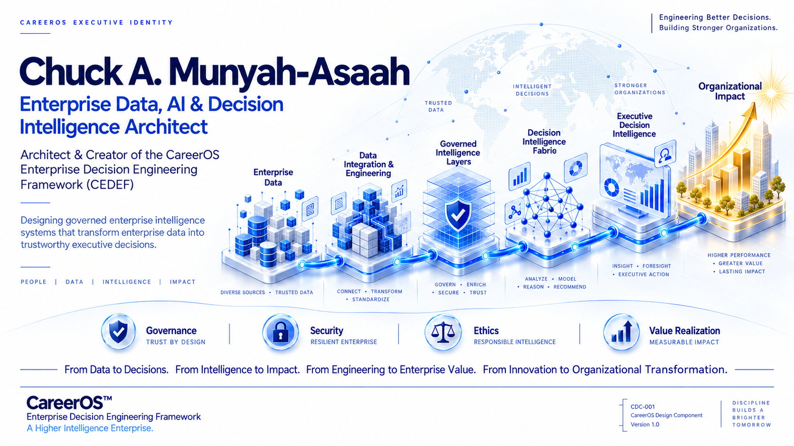

# Chuck A. Munyah-Asaah

## Enterprise Data, AI & Decision Intelligence Architect

### Architect & Creator of the CareerOS Enterprise Decision Engineering Framework (CEDEF)

*Designing governed enterprise intelligence systems that transform enterprise data into trustworthy executive decisions.*

 

 

**CareerOS Executive Portal**

Official Professional Homepage

Enterprise AI • Decision Intelligence • Executive Leadership • Enterprise Engineering

---

# Executive Mission

My mission is to advance **Enterprise Decision Engineering** as an internationally recognized enterprise engineering discipline that enables organizations to transform enterprise intelligence into trustworthy executive decisions.

Through **CareerOS** and **TAKE**, I am developing an integrated ecosystem of enterprise methodologies, intelligent software, reference standards, executive publications, consulting services, education, and industry reference implementations that help organizations engineer better decisions through governed enterprise intelligence.

I believe the future of Enterprise AI lies not in producing more information, but in enabling better decisions through disciplined engineering, governance, and organizational intelligence.

---

# Quick Navigation

| Section | Description |
|----------|-------------|
| 🚀 [Executive Summary](#executive-summary) | Professional overview and mission |
| 🏛️ [Meet the Architect](#meet-the-architect) | Professional background |
| 🧠 [Professional Capabilities](#professional-capabilities) | Areas of expertise |
| 🌍 [CareerOS Ecosystem](#careeros-ecosystem) | Enterprise engineering ecosystem |
| 🎯 [Professional Vision](#professional-vision) | Long-term vision |
| 🤝 [Let's Connect](#lets-connect) | Professional contact information |

# Executive Summary

The **CareerOS Executive Portal** is the professional headquarters of **Chuck A. Munyah-Asaah**, Enterprise Data, AI & Decision Intelligence Architect and creator of the **CareerOS Enterprise Decision Engineering Framework (CEDEF).**

It serves as the central gateway to my work in Enterprise Information Systems, Artificial Intelligence, Decision Intelligence, Healthcare Analytics, Enterprise Architecture, Executive Decision Support, and Organizational Transformation.

Rather than presenting a traditional professional profile, this portal introduces the philosophy, engineering vision, research, publications, and enterprise initiatives that collectively define the CareerOS ecosystem.

Visitors can explore the Enterprise Decision Engineering Framework, reference implementations, executive publications, research initiatives, and future enterprise engineering projects designed to help organizations transform enterprise intelligence into trustworthy executive decisions.

Whether you are an executive leader, enterprise architect, researcher, consultant, educator, recruiter, or technology professional, this portal provides a starting point for understanding both my professional work and the broader CareerOS vision.

---

# Meet the Architect

I am **Chuck A. Munyah-Asaah**, an Enterprise Data, AI & Decision Intelligence Architect with professional experience spanning Enterprise Information Systems, Healthcare Information Systems, National Health Information Systems, Business Intelligence, Enterprise Analytics, Artificial Intelligence, Executive Reporting, and Organizational Decision Support.

My academic foundation includes a **Master of Science in Business and Data Analytics** from **California State University, San Bernardino**, where advanced study in analytics, statistics, enterprise systems, and decision science strengthened decades of practical enterprise experience.

Throughout my career I repeatedly encountered the same organizational challenge.

Organizations invested heavily in enterprise systems.

They generated increasing volumes of enterprise data.

They implemented Business Intelligence platforms, Artificial Intelligence solutions, predictive models, and executive dashboards.

Yet many continued to struggle with one fundamental question.

> **How do organizations consistently transform enterprise intelligence into trustworthy executive decisions?**

That question became the catalyst for the creation of the **CareerOS Enterprise Decision Engineering Framework (CEDEF)**.

Today my work is focused on advancing Enterprise Decision Engineering through research, enterprise architecture, intelligent software, executive consulting, education, and industry reference implementations that enable organizations to engineer better decisions through governed enterprise intelligence.

My long-term objective extends beyond technology.

It is to contribute to the establishment of **Enterprise Decision Engineering** as an internationally recognized enterprise engineering discipline that strengthens organizational governance, executive leadership, and sustainable enterprise value.

---

> **"Organizations create lasting value not by producing more information, but by consistently making better decisions."**

# Professional Capabilities

My work is centered on the design, engineering, governance, and implementation of enterprise intelligence systems that transform organizational data into trustworthy executive decision intelligence.

My professional capabilities span multiple disciplines that collectively support enterprise transformation.

---

## Enterprise Data & Analytics

Designing enterprise data foundations that support trusted analytics and executive decision-making.

**Core Capabilities**

- Enterprise Data Engineering
- Data Analytics
- Statistical Analysis
- Data Modeling
- SQL Development
- Enterprise Data Governance
- Data Quality Engineering
- Information Management

---

## Business Intelligence & Decision Intelligence

Transforming enterprise information into meaningful organizational insight and executive decision support.

**Core Capabilities**

- Business Intelligence
- Executive Reporting
- Dashboard Engineering
- KPI Architecture
- Decision Intelligence
- Executive Decision Support
- Performance Measurement
- Organizational Intelligence

---

## Enterprise Artificial Intelligence

Engineering governed AI capabilities that operate responsibly, transparently, and in alignment with enterprise objectives.

**Core Capabilities**

- Enterprise Artificial Intelligence
- Machine Learning
- Predictive Analytics
- Explainable AI (XAI)
- Intelligent Decision Systems
- AI Governance
- Responsible AI

---

## Healthcare Analytics & Information Systems

Applying enterprise intelligence to improve healthcare operations, clinical decision-making, and population health.

**Core Capabilities**

- Healthcare Information Systems
- Healthcare Analytics
- Clinical Analytics
- Population Health Analytics
- Healthcare Decision Support
- Health Information Management

---

## Enterprise Architecture & Organizational Transformation

Designing enterprise engineering methodologies that align technology, governance, people, and strategy.

**Core Capabilities**

- Enterprise Architecture
- Enterprise Information Systems
- Digital Transformation
- Business Process Improvement
- Enterprise Governance
- Organizational Transformation
- Strategic Planning

---

# CareerOS Ecosystem

CareerOS is more than a framework.

It is a growing enterprise engineering ecosystem dedicated to advancing **Enterprise Decision Engineering** through research, publications, enterprise software, consulting, executive education, and industry reference implementations.

Every component of the ecosystem has a distinct purpose.

Together they establish a governed body of knowledge for transforming enterprise intelligence into trustworthy executive decision-making.

 

### CareerOS Ecosystem Journey

*From Executive Vision to Organizational Transformation.*

---

## Explore the CareerOS Ecosystem

### 📘 Framework Portal

The official home of the **CareerOS Enterprise Decision Engineering Framework (CEDEF)**.

Explore the philosophy, architecture, engineering methodology, Signature Visuals, Preview Edition, and future Reference Standards.

---

### 🛍 Reference Implementation Portal

Experience Enterprise Decision Engineering through practical enterprise implementations.

The first official implementation demonstrates AI-driven demand forecasting and inventory optimization while showcasing the complete CareerOS engineering methodology.

---

### 📄 CareerOS Publications

Explore executive publications that communicate the philosophy, architecture, research, and evolution of Enterprise Decision Engineering.

Publication families include:

- Preview Editions (PE)
- Executive White Papers (WP)
- Reference Standards (RS)

---

### 🎓 Executive Education

Future CareerOS educational initiatives will provide structured learning pathways, certification programs, executive workshops, and professional development designed to prepare enterprise leaders for the next generation of decision engineering.

---

### 🤝 Enterprise Consulting

CareerOS consulting services are being developed to help organizations design, govern, and implement enterprise intelligence systems that improve executive decision-making and accelerate organizational transformation.

# Professional Vision

My long-term vision is to help establish **Enterprise Decision Engineering** as a globally recognized enterprise engineering discipline that transforms how organizations design, govern, and apply enterprise intelligence.

Through **CareerOS** and **TAKE**, I am building an integrated ecosystem of enterprise methodologies, intelligent software, executive publications, professional consulting, research initiatives, executive education, and industry reference implementations that strengthen organizational decision-making across the public and private sectors.

My objective extends beyond developing technology.

It is to help organizations create lasting enterprise value through governed intelligence, disciplined engineering, and trustworthy executive decisions.

I believe the future belongs to organizations that engineer intelligence with the same discipline that previous generations applied to software, systems, and enterprise architecture.

That future begins with better decisions.

---

# Let's Connect

I welcome opportunities to collaborate with organizations, universities, research institutions, consulting firms, government agencies, and industry leaders who share an interest in Enterprise AI, Decision Intelligence, Enterprise Architecture, Healthcare Analytics, Business Intelligence, and Organizational Transformation.

Whether you are interested in research, executive consulting, strategic partnerships, speaking engagements, or collaborative innovation, I would be pleased to connect.

## Professional Profiles

💼 **LinkedIn**

https://www.linkedin.com/in/chuck-munyah-asaah-4379b563/

 

💻 **GitHub**

https://github.com/camunyah

---

# Explore the CareerOS Ecosystem

Continue exploring the CareerOS ecosystem through its official repositories.

| Repository | Purpose |
|------------|---------|
| 🏠 **Executive Portal** | Professional profile, executive vision, and CareerOS leadership |
| 📘 **Framework Portal** | CareerOS Enterprise Decision Engineering Framework (CEDEF) |
| 🛍 **Reference Implementation Portal** | AI-Driven Demand Forecasting & Inventory Optimization |

As the CareerOS ecosystem continues to grow, additional repositories will introduce new reference implementations, enterprise engineering standards, executive publications, intelligent software, and educational resources.

---

# CareerOS Enterprise Decision Engineering Philosophy

> **From Data to Decisions.**

> **From Intelligence to Impact.**

> **From Engineering to Enterprise Value.**

> **From Innovation to Organizational Transformation.**

 

---

### CareerOS™

### Enterprise Decision Engineering Framework (CEDEF)

**Official Executive Portal**

**Version 2.0**

